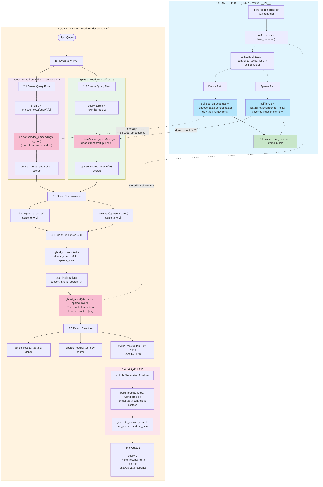

# RAG V1 Hybrid Retrieval System — Technical Specification

> Implementation-aware documentation for the RAG-based ISO 27001:2022 control retrieval system.

---

## 1. Document Processing Pipeline

### 1.1 Source of Documents

| Attribute | Detail |
|-----------|--------|
| **Format** | JSON (`.json`) |
| **Location** | `data/iso_controls.json` (relative to project root) |
| **Content** | ISO 27001:2022 Annex A controls in Indonesian language |

### Base fields (always present)

| Field | Description |
|-------|-------------|
| `control_id` | Unique identifier (e.g. `"A.5.1"`, `"A.5.2"`) |
| `title` | Short title in Indonesian |
| `objective` | Objective statement |
| `description` | Full control description in Indonesian |
| `implementation_guidance` | Implementation guidance |

### Enrichment fields (present in enriched dataset, used by `control_to_text()`)

| Field | Description |
|-------|-------------|
| `keywords_en` | English keywords for semantic matching |
| `keywords_id` | Indonesian keywords for semantic matching |
| `audit_indicators_en` | English audit indicator phrases |
| `audit_indicators_id` | Indonesian audit indicator phrases |
| `related_assets_en` | English related asset terms |
| `related_assets_id` | Indonesian related asset terms |
| `security_principles_en` | English security principle terms |
| `security_principles_id` | Indonesian security principle terms |

> **Note**: The pipeline loads `data/iso_controls.json` (base 5 fields only). An enriched variant `data/iso_controls_enriched.json` exists with all 13 fields. The `control_to_text()` function uses `.get()` so it works with both formats — extra fields are included when present, silently skipped when absent.

**Example base record** (`data/iso_controls.json`):

```json
{
  "control_id": "A.5.1",
  "title": "Kebijakan keamanan informasi",
  "objective": "Memberikan arahan dan dukungan manajemen untuk keamanan informasi...",
  "description": "Kebijakan keamanan informasi harus didefinisikan, disetujui oleh manajemen...",
  "implementation_guidance": "Organisasi harus menetapkan kebijakan keamanan informasi..."
}
```

The dataset contains **93 controls** (A.5.1–A.8.34), which constitute the entire document corpus.

---

### 1.2 Dense Retrieval (Embedding Pipeline)

#### a. Responsible Files

| File | Role |
|------|------|
| `dense/embedding_model.py` | Embedding model wrapper: loading, encoding, normalization |
| `hybrid/hybrid_retriever.py` | Orchestrates dense inference within the hybrid retrieval flow |

#### b. Text Representation

Documents are converted from raw JSON into a flat text string before embedding. This is done by the function:

**`dense/embedding_model.py:33-72` — `control_to_text(control: dict) -> str`**

```python
def control_to_text(control: dict) -> str:
    parts = [
        control.get('title', ''),
        control.get('objective', ''),
        control.get('description', ''),
    ]

    keywords_en = control.get('keywords_en', [])
    keywords_id = control.get('keywords_id', [])
    if keywords_en or keywords_id:
        parts.append(' '.join(keywords_en))
        parts.append(' '.join(keywords_id))

    audit_indicators_en = control.get('audit_indicators_en', [])
    audit_indicators_id = control.get('audit_indicators_id', [])
    if audit_indicators_en or audit_indicators_id:
        parts.append(' '.join(audit_indicators_en))
        parts.append(' '.join(audit_indicators_id))

    related_assets_en = control.get('related_assets_en', [])
    related_assets_id = control.get('related_assets_id', [])
    if related_assets_en or related_assets_id:
        parts.append(' '.join(related_assets_en))
        parts.append(' '.join(related_assets_id))

    security_principles_en = control.get('security_principles_en', [])
    security_principles_id = control.get('security_principles_id', [])
    if security_principles_en or security_principles_id:
        parts.append(' '.join(security_principles_en))
        parts.append(' '.join(security_principles_id))

    return ' | '.join(parts)
```

- **Input**: A single control dictionary from `iso_controls.json`
- **Output**: A pipe-separated concatenation of all available fields
- **Core fields**: `title`, `objective`, `description` — always included
- **Enriched fields** (optional, used when present in the data): `keywords_en/id`, `audit_indicators_en/id`, `related_assets_en/id`, `security_principles_en/id`
- **Why**: Combines base fields plus semantic enrichment for better retrieval quality; uses `.get()` with defaults so it works with both `iso_controls.json` (5 fields) and `iso_controls_enriched.json` (13 fields)
- `implementation_guidance` is excluded from the retrieval text

#### c. Embedding Model

| Parameter | Value |
|-----------|-------|
| **Model name** | `paraphrase-multilingual-MiniLM-L12-v2` |
| **Embedding dimension** | 384 |
| **Library** | `sentence-transformers` |
| **Source** | Hugging Face Hub (downloaded on first use; cached locally thereafter) |

**`dense/embedding_model.py` — `get_model() -> SentenceTransformer`**

```python
def get_model() -> SentenceTransformer:
    global _model
    if _model is None:
        _model = SentenceTransformer(MODEL_NAME)
    return _model
```

- **Input**: None
- **Output**: Singleton `SentenceTransformer` instance
- **Behavior**: Lazy-loads the model on first call; subsequent calls return the cached instance

**`dense/embedding_model.py:16-17` — `get_embedding_dim() -> int`**

```python
def get_embedding_dim() -> int:
    return int(get_model().get_sentence_embedding_dimension())
```

- **Input**: None
- **Output**: Embedding dimension as integer (384 for the current model)
- **Behavior**: Queries the loaded model for its native embedding dimension; used by downstream components

#### d. Embedding Function

**`dense/embedding_model.py` — `encode_texts(texts: list[str]) -> np.ndarray`**

```python
def encode_texts(texts: list[str]) -> np.ndarray:
    model = get_model()
    embeddings = model.encode(texts, convert_to_numpy=True, show_progress_bar=False)
    embeddings = embeddings.astype(np.float32)
    return normalize(embeddings)
```

- **Input**: `list[str]` — a batch of text strings to embed
- **Output**: `np.ndarray` of shape `(n_texts, 384)`, L2-normalized, `float32`
- **Steps**:
  1. Loads the multilingual MiniLM model
  2. Encodes all texts in one batch to numpy arrays
  3. Casts to `float32` for memory efficiency
  4. Applies L2 normalization (see below)

#### e. Normalization

**`dense/embedding_model.py` — `normalize(vectors: np.ndarray) -> np.ndarray`**

```python
def normalize(vectors: np.ndarray) -> np.ndarray:
    norms = np.linalg.norm(vectors, axis=1, keepdims=True)
    norms = np.where(norms == 0, 1.0, norms)
    return vectors / norms
```

- L2-normalizes each embedding vector so that cosine similarity reduces to dot product
- Guards against zero-norm vectors by replacing zero norms with 1.0

#### f. Storage (Vector Database)

| Attribute | Detail |
|-----------|--------|
| **Storage type** | In-memory numpy array |
| **Format** | `np.ndarray` of shape `(n_docs, 384)`, dtype `float32` |
| **Persistence** | **Recomputed every run** — not persisted to disk |
| **Location** | `HybridRetriever.doc_embeddings` (see `hybrid/hybrid_retriever.py:20`) |
| **Similarity** | Dot product on L2-normalized vectors (equivalent to cosine similarity) |

**Initialization** (`hybrid/hybrid_retriever.py:16-21`):

```python
def __init__(self, controls_path: Path):
    self.controls_path = controls_path
    self.controls = self._load_controls()
    self.control_texts = [control_to_text(c) for c in self.controls]
    self.doc_embeddings = encode_texts(self.control_texts)
    self.bm25 = BM25Retriever(self.control_texts)
```

- `_load_controls()` reads and parses `iso_controls.json`
- `control_texts` is the list of pipe-joined string representations
- `doc_embeddings` is the dense vector index (rebuilt at startup)
- No FAISS index is used; similarity is computed via direct `np.dot` in `_dense_scores()`

---

### 1.3 Sparse Retrieval (BM25 / Inverted Index)

#### a. Responsible File

| File | Role |
|------|------|
| `sparse/bm25.py` | Tokenizer, BM25 index builder, and scoring function |

#### b. Preprocessing Pipeline

The preprocessing pipeline consists of three steps, all within the `tokenize()` function:

**`sparse/bm25.py` — `tokenize(text: str) -> list[str]`**

```python
def tokenize(text: str) -> list[str]:
    return re.findall(r"[A-Za-z0-9]+", text.lower())
```

| Step | Implementation | Detail |
|------|---------------|--------|
| **Case folding** | `text.lower()` | Converts all characters to lowercase |
| **Tokenization** | `re.findall(r"[A-Za-z0-9]+", ...)` | Extracts only alphanumeric tokens; non-ASCII characters (e.g., Indonesian diacritics, punctuation) are discarded |
| **Stopword removal** | **Not implemented** | No stopword list is used |
| **Stemming** | **Not implemented** | No stemming or lemmatization is applied |

**Note**: Because the documents are in Indonesian (which uses Latin script with some diacritics), the simple alphanumeric regex may discard accented characters. This is a known limitation.

#### c. Index Construction

**`sparse/bm25.py` — `BM25Retriever` class**

```python
class BM25Retriever:
    def __init__(self, documents: list[str], k1: float = 1.5, b: float = 0.75):
        self.k1 = k1
        self.b = b
        self.documents = documents
        self.tokenized_docs = [tokenize(doc) for doc in documents]
        self.doc_lens = [len(doc) for doc in self.tokenized_docs]
        self.avg_doc_len = sum(self.doc_lens) / max(len(self.doc_lens), 1)
        self.doc_freq = self._compute_doc_freq()
        self.idf = self._compute_idf()
        self.term_freqs = [Counter(doc) for doc in self.tokenized_docs]
```

| Attribute | Description |
|-----------|-------------|
| `documents` | Raw document texts (the retrieval unit strings) |
| `tokenized_docs` | Tokenized version of each document |
| `doc_lens` | Token count per document |
| `avg_doc_len` | Mean document length across the corpus |
| `doc_freq` | Document frequency per term (how many docs contain each term) |
| `idf` | Pre-computed IDF values for all terms |
| `term_freqs` | Term frequency per document (as `collections.Counter`) |

| Attribute | Detail |
|-----------|--------|
| **Build time** | **Every run** — index is built when `HybridRetriever` is instantiated |
| **Memory** | Stored in-memory as Python dicts and Counters |
| **Persistence** | **Not persisted** to disk |

#### d. Document Frequency Computation

**`sparse/bm25.py:22-28` — `_compute_doc_freq() -> dict[str, int]`**

```python
def _compute_doc_freq(self) -> dict[str, int]:
    doc_freq: dict[str, int] = {}
    for doc in self.tokenized_docs:
        unique_terms = set(doc)
        for term in unique_terms:
            doc_freq[term] = doc_freq.get(term, 0) + 1
    return doc_freq
```

- For each document, only unique terms are counted (a term contributes at most 1 to document frequency per document)
- Result: `{term: number_of_docs_containing_term}`

#### e. IDF Computation

**`sparse/bm25.py:30-35` — `_compute_idf() -> dict[str, float]`**

```python
def _compute_idf(self) -> dict[str, float]:
    n_docs = len(self.tokenized_docs)
    idf: dict[str, float] = {}
    for term, freq in self.doc_freq.items():
        idf[term] = math.log(1 + (n_docs - freq + 0.5) / (freq + 0.5))
    return idf
```

- Implements the **Okapi BM25 IDF formula**: `log(1 + (N - df + 0.5) / (df + 0.5))`
- `N` = total number of documents
- `df` = document frequency of the term
- This formulation prevents negative IDF values

#### f. BM25 Scoring Function

**`sparse/bm25.py:37-54` — `score_query(query: str) -> list[float]`**

```python
def score_query(self, query: str) -> list[float]:
    query_terms = tokenize(query)
    scores: list[float] = []
    for idx, tf_doc in enumerate(self.term_freqs):
        score = 0.0
        doc_len = self.doc_lens[idx]
        denom_norm = self.k1 * (1 - self.b + self.b * doc_len / max(self.avg_doc_len, 1e-9))
        for term in query_terms:
            if term not in tf_doc:
                continue
            tf = tf_doc[term]
            term_idf = self.idf.get(term, 0.0)
            numerator = tf * (self.k1 + 1)
            denominator = tf + denom_norm
            score += term_idf * (numerator / max(denominator, 1e-9))
        scores.append(score)
    return scores
```

- **Input**: raw query string
- **Output**: list of BM25 scores, one per document in the corpus
- **Behavior**: For each document, computes the sum over query terms of:
  - **TF component**: `tf * (k1 + 1) / (tf + k1 * (1 - b + b * doc_len / avg_doc_len))`
    - `tf` = term frequency in the document
    - `k1` = saturation parameter (1.5 by default)
    - `b` = length normalization parameter (0.75 by default)
  - **IDF component**: pre-computed from `_compute_idf()`
  - **Length normalization**: applied via the denominator normalization term

---

## 2. Query Processing Pipeline

### 2.1 Dense Query Flow

#### Step-by-Step

```
User Query
    ↓
[1] query text
    ↓
[2] encode_texts([query]) → query embedding (384-dim)
    ↓
[3] dot product with doc_embeddings → similarity scores
    ↓
[4] argsort descending → top-K indices
    ↓
[5] build result dicts with control metadata + scores
```

#### Key Functions

**`dense/embedding_model.py` — `encode_texts(texts: list[str]) -> np.ndarray`**

Same function used for document embedding. Encodes the query into an L2-normalized 384-dimensional vector.

**`hybrid/hybrid_retriever.py:36-38` — `_dense_scores(query: str) -> np.ndarray`**

```python
def _dense_scores(self, query: str) -> np.ndarray:
    q_emb = encode_texts([query])[0]
    return np.dot(self.doc_embeddings, q_emb)
```

- Embeds the query
- Computes dot product against all document embeddings (since both are L2-normalized, this equals cosine similarity)
- Returns a score vector of shape `(n_docs,)`

**`hybrid/hybrid_retriever.py:122-127` — Top-K selection** (inside `retrieve()`):

```python
if "dense" in order and dense_scores is not None:
    dense_rank = np.argsort(-dense_scores)[:k]
    dense_results = [
        self._build_result(i, float(dense_scores_for_build[i]), ...)
        for i in dense_rank
    ]
```

- `np.argsort(-dense_scores)` gives indices in descending score order
- Top `k` indices are mapped to result dictionaries via `_build_result()`

---

### 2.2 Sparse Query Flow

#### Step-by-Step

```
User Query
    ↓
[1] tokenize(query) → query tokens
    ↓
[2] For each document:
    ├── lookup query terms in term_freqs[doc_idx]
    ├── compute BM25 score (TF × IDF with length normalization)
    └── accumulate
    ↓
[3] collect scores → score vector (n_docs)
    ↓
[4] argsort descending → top-K indices
    ↓
[5] build result dicts
```

#### Key Functions

**`sparse/bm25.py:6-7` — `tokenize(text: str) -> list[str]`**

Tokenizes the query using the same `[A-Za-z0-9]+` regex.

**`sparse/bm25.py:37-54` — `BM25Retriever.score_query(query: str) -> list[float]`**

Computes BM25 scores against all documents as described in Section 1.3.f.

**`hybrid/hybrid_retriever.py:128-133` — Top-K selection** (inside `retrieve()`):

```python
if "sparse" in order and sparse_scores is not None:
    sparse_rank = np.argsort(-sparse_scores)[:k]
    sparse_results = [
        self._build_result(i, float(dense_scores_for_build[i]), float(sparse_scores_for_build[i]), ...)
        for i in sparse_rank
    ]
```

---

## 3. Hybrid Retrieval Pipeline

### 3.1 Retrieval Strategy

Dense and sparse retrieval run **sequentially on demand**, controlled by the `method_order` parameter.

**`hybrid/hybrid_retriever.py:64` — `retrieve()` method**

```python
def retrieve(self, query: str, k: int = 3,
             method_order: list[str] | tuple[str, ...] | None = None,
             dense_weight: float | None = None,
             sparse_weight: float | None = None) -> dict:
    order = self._normalize_method_order(method_order)
    _dw = dense_weight if dense_weight is not None else DENSE_WEIGHT
    _sw = sparse_weight if sparse_weight is not None else SPARSE_WEIGHT
    # ...
    def ensure_dense():
        # computes _dense_scores() if not already computed
    def ensure_sparse():
        # computes bm25.score_query() if not already computed
    def ensure_hybrid():
        # computes dense + sparse, normalizes, fuses with _dw/_sw
    executors = {"dense": ensure_dense, "sparse": ensure_sparse, "hybrid": ensure_hybrid}
    for method_name in order:
        executors[method_name]()
```

- `dense_weight` / `sparse_weight`: optional per-call overrides for fusion weights; defaults to `DENSE_WEIGHT` (0.6) and `SPARSE_WEIGHT` (0.4)

| Method order | Execution behavior |
|-------------|-------------------|
| `["dense", "sparse", "hybrid"]` (default) | Dense → Sparse → Hybrid |
| `["hybrid"]` | Computes all components internally (dense scores + sparse scores → normalize → fuse) |
| `["dense"]` | Dense only |
| `["sparse"]` | Sparse only |

The lazy-evaluation pattern (`ensure_*` closures) ensures that if hybrid is requested after dense and sparse have already run, their scores are reused rather than recomputed.

### 3.2 Candidate Merging

**Strategy: No merging.** Dense, sparse, and hybrid each produce their own top-K results independently over the **same candidate universe** (all documents).

- All three result sets are returned separately: `dense_results`, `sparse_results`, `hybrid_results`
- The final generation step uses `hybrid_results` only
- No union or intersection is performed on candidate sets

### 3.3 Score Normalization

**`hybrid/hybrid_retriever.py:27-34` — `_minmax(scores: list[float]) -> np.ndarray`**

```python
@staticmethod
def _minmax(scores: list[float]) -> np.ndarray:
    arr = np.array(scores, dtype=np.float32)
    min_v = float(np.min(arr))
    max_v = float(np.max(arr))
    if max_v - min_v <= 1e-12:
        return np.zeros_like(arr)
    return (arr - min_v) / (max_v - min_v)
```

- Applies **min-max normalization** to scale scores to `[0, 1]`
- Edge case: if all scores are identical (range ≤ 1e-12), returns a zero vector
- Both dense and sparse scores are normalized independently **before** fusion

### 3.4 Fusion Method

**Method: Weighted Sum (with per-call override)**

**`hybrid/hybrid_retriever.py:66-67,99-103`:**

```python
_dw = dense_weight if dense_weight is not None else DENSE_WEIGHT
_sw = sparse_weight if sparse_weight is not None else SPARSE_WEIGHT
# ...
dense_norm = self._minmax(dense_for_hybrid.tolist())
sparse_norm = self._minmax(sparse_for_hybrid.tolist())
hybrid_scores = _dw * dense_norm + _sw * sparse_norm
```

**Fusion formula:**

```
hybrid_score(doc) = w_dense × minmax_norm(dense_score(doc)) + w_sparse × minmax_norm(bm25_score(doc))
```

| Parameter | Default | Per-call override | Defined in |
|-----------|---------|-------------------|-----------|
| `w_dense` | `0.6` (`DENSE_WEIGHT`) | `dense_weight` arg in `retrieve()` | `hybrid/hybrid_retriever.py:10` |
| `w_sparse` | `0.4` (`SPARSE_WEIGHT`) | `sparse_weight` arg in `retrieve()` | `hybrid/hybrid_retriever.py:11` |

- Default weights prioritize semantic (dense) matching while incorporating lexical (sparse) evidence
- Per-call overrides allow evaluation sweeps with different weight combinations without restarting
- The per-call weights are also reported in the return structure's `fusion` object

**Why not Reciprocal Rank Fusion (RRF)?** This implementation uses a single-stage score-level fusion rather than rank-based fusion, because all documents are scored simultaneously (no separate candidate pools to merge).

### 3.5 Final Ranking

**`hybrid/hybrid_retriever.py:134-139`:**

```python
if "hybrid" in order and hybrid_scores is not None:
    hybrid_rank = np.argsort(-hybrid_scores)[:k]
    hybrid_results = [
        self._build_result(i, float(dense_scores_for_build[i]), float(sparse_scores_for_build[i]), float(hybrid_scores_for_build[i]))
        for i in hybrid_rank
    ]
```

- All documents are ranked by the fused `hybrid_score` (descending)
- Top `k` (default: 3) are returned as `hybrid_results`
- Each result includes all three scores (`dense_score`, `sparse_score`, `hybrid_score`) for transparency

### 3.6 Return Structure

**`hybrid/hybrid_retriever.py:141-157`:**

```python
return {
    "dense_results": dense_results,   # top-k by dense score
    "sparse_results": sparse_results, # top-k by sparse score
    "hybrid_results": hybrid_results, # top-k by fused score
    "timings": {
        "dense_time": ...,
        "sparse_time": ...,
        "hybrid_time": ...,
        "total_time": ...,
    },
    "fusion": {
        "method": "weighted_sum",
        "dense_weight": _dw,        # actual per-call or default weight
        "sparse_weight": _sw,       # actual per-call or default weight
    },
    "method_order": order,
}
```

---

## 4. LLM Generation Pipeline

### 4.1 Responsible Files

| File | Role |
|------|------|
| `llm/llm_wrapper.py` | Ollama API call, response parsing, JSON extraction |
| `pipeline/rag_pipeline.py` | Orchestrates retrieval → prompt construction → LLM call |
| `prompts/prompt_template.txt` | System prompt template for the LLM (ISO 27001:2022 auditor) |
| `prompts/prompt_rewriting.txt` | Query rewriting/extraction prompt template for structured query preprocessing |

### 4.2 Prompt Construction

**`pipeline/rag_pipeline.py:31-39` — `build_prompt()`**

```python
def build_prompt(self, query: str, hybrid_results: list[dict[str, Any]]) -> str:
    template = self._load_prompt_template()
    context = self._format_context(hybrid_results)
    return (
        f"{template}\n\n"
        f"Konteks kontrol ISO hasil retrieval hybrid (top-k):\n{context}\n\n"
        f"Pertanyaan audit:\n\"{query}\"\n\n"
        f"Jawab hanya dalam satu JSON object."
    )
```

The final prompt consists of:
1. **System prompt** (from `prompts/prompt_template.txt`) — defines the LLM as an ISO 27001:2022 auditor
2. **Retrieved context** — formatted list of top-k hybrid results with scores
3. **User query** — the original audit question
4. **Output constraint** — instructs the LLM to output a single JSON object

**Context formatting** (`pipeline/rag_pipeline.py:20-29`):

```python
def _format_context(self, hybrid_results: list[dict[str, Any]]) -> str:
    lines: list[str] = []
    for idx, item in enumerate(hybrid_results, start=1):
        lines.append(
            f"{idx}. {item['control_id']} - {item['title']} | "
            f"dense={item['dense_score']:.4f}, sparse={item['sparse_score']:.4f}, hybrid={item['hybrid_score']:.4f}"
        )
        lines.append(f"   Objective: {item['objective']}")
        lines.append(f"   Description: {item['description'][:220]}...")
    return "\n".join(lines)
```

### 4.3 LLM Call

**`llm/llm_wrapper.py:52-59` — `generate_answer(prompt: str) -> dict[str, Any]`**

| Parameter | Value |
|-----------|-------|
| **Endpoint** | `http://localhost:11434/api/generate` (Ollama) |
| **Model** | `qwen2.5:3b` |
| **Temperature** | `0.0` (deterministic) |
| **Max tokens** | `256` (`num_predict`) |
| **Streaming** | Disabled |

```python
def call_ollama(prompt: str) -> str:
    payload = {
        "model": MODEL_NAME,
        "prompt": prompt,
        "temperature": TEMPERATURE,
        "stream": False,
        "options": {"num_predict": 256},
    }
    resp = requests.post(OLLAMA_URL, json=payload, timeout=REQUEST_TIMEOUT)
    resp.raise_for_status()
    data = resp.json()
    return str(data.get("response", "")).strip()
```

### 4.4 JSON Extraction

**`llm/llm_wrapper.py:27-49` — `extract_json(text: str) -> dict | None`**

Attempts two strategies:
1. Direct `json.loads()` on the raw response
2. Regex search for the first `{...}` JSON object block

Returns the parsed JSON dict, or `None` if parsing fails.

### 4.5 Full Pipeline Orchestration

**`pipeline/rag_pipeline.py:41-64` — `RAGPipeline.run()`**

```python
def run(self, query: str, k: int = 3) -> dict[str, Any]:
    retrieval = self.retriever.retrieve(query=query, k=k)
    prompt = self.build_prompt(query=query, hybrid_results=retrieval["hybrid_results"])
    # ...
    llm_result = generate_answer(prompt)
    # ...
    return {
        "query": query,
        "dense_results": retrieval["dense_results"],
        "sparse_results": retrieval["sparse_results"],
        "hybrid_results": retrieval["hybrid_results"],
        "answer": answer,
        "llm_model": llm_model,
        "llm_error": llm_error,
        "fusion": retrieval["fusion"],
    }
```

**End-to-end flow:**

```
User query
    ↓
HybridRetriever.retrieve(query, k=3)
    ├── ensure_dense()   → _dense_scores(query)    → np.dot(embeddings, q_emb)
    ├── ensure_sparse()  → bm25.score_query(query) → BM25 scores
    └── ensure_hybrid()  → minmax normalize → weighted sum → hybrid scores
    ↓
RAGPipeline.build_prompt(query, hybrid_results)
    ├── Load prompt_template.txt
    ├── Format top-k controls as context
    └── Assemble final prompt
    ↓
LLM (qwen2.5:3b via Ollama)
    ├── call_ollama(prompt)
    ├── extract_json(response)
    └── Return parsed JSON or raw text
    ↓
Return: {
    dense_results, sparse_results, hybrid_results,
    answer (parsed JSON),
    llm_model, fusion info
}
```

---

## 5. Evaluation Pipeline

### 5.1 Responsible Files

| File | Role |
|------|------|
| `evaluation/test_queries.json` | Test dataset with 5 labeled queries |
| `evaluation/evaluate.py` | Standalone evaluation script |
| `app/app.py` | Web-based evaluation dashboard with bulk evaluation + history logging |

### 5.2 Metrics Computed

**`app/app.py:438-484` — `compute_metrics()`**

For each retrieval method (dense, sparse, hybrid), the following metrics are computed at `k` (default: 3):

| Metric | Formula |
|--------|---------|
| **Hit@k** | `1` if any predicted control_id matches ground truth, else `0` |
| **Recall@k** | `|predicted ∩ ground_truth| / |ground_truth|` |
| **Precision@k** | `|predicted ∩ ground_truth| / k` |
| **MRR** | `1 / rank_of_first_relevant` (0 if no relevant found) |
| **NDCG@k** | `DCG@k / IDCG@k` where `DCG = Σ 1/log₂(rank+1)` for relevant items |
| **MAP@k** | Average Precision over top-k, normalized by total relevant items |

### 5.3 History Storage

Results are logged to an **SQLite database** (`rag_history.db`) via the Flask API at `app/app.py`. The database schema stores per-query results for all three methods, including scores, metrics, and timings.

---

## 6. Project Structure Summary

```
ragV1/
├── app/
│   ├── app.py                        # Flask web server, evaluation dashboard, history management, V3 integration
│   └── check_token_lengths.py        # Token length analysis utility
├── data/
│   ├── iso_controls.json             # Document corpus (93 ISO 27001:2022 Annex A controls)
│   ├── iso_controls_enriched.json    # Enriched corpus with semantic metadata (13 fields per control)
│   ├── iso_controls_full.json        # Full enriched corpus
│   └── enrich_*.py                   # Enrichment scripts for adding semantic metadata
├── dense/
│   └── embedding_model.py            # Model loader, encoder, normalizer, control_to_text() with enrichment
├── sparse/
│   ├── __init__.py
│   └── bm25.py                       # Tokenizer, BM25Retriever class, BM25 scoring
├── hybrid/
│   └── hybrid_retriever.py           # HybridRetriever: dense + sparse + weighted fusion with per-call params
├── pipeline/
│   ├── __init__.py
│   └── rag_pipeline.py               # RAGPipeline: retrieval → prompt → LLM orchestration
├── llm/
│   ├── __init__.py
│   └── llm_wrapper.py                # Ollama API client, JSON extraction
├── prompts/
│   ├── prompt_template.txt           # ISO 27001 auditor system prompt
│   └── prompt_rewriting.txt          # Query rewriting/extraction prompt template
├── evaluation/
│   ├── __init__.py
│   ├── evaluate.py                   # CLI evaluation script
│   └── test_queries.json             # Labeled test queries (5 queries)
├── baselineRAGv1.md                  # Design notes and baseline definition
├── rag_history.db                    # SQLite evaluation history (V1)
├── start_v1.bat                      # Startup batch script
└── v3_queue.json                     # V3 queue persistence file
```

---

## 7. Key Design Decisions

| Decision | Choice | Rationale |
|----------|--------|-----------|
| Embedding model | `paraphrase-multilingual-MiniLM-L12-v2` | Multilingual support for Indonesian text; 384-dim provides good efficiency/quality trade-off |
| Similarity | Dot product on L2-normalized vectors | Equivalent to cosine similarity; computationally efficient |
| Fusion method | Weighted sum (default 0.6 dense + 0.4 sparse, configurable per call) | Single-stage score fusion over identical candidate pool; weights chosen to prioritize semantic match |
| Normalization | Min-max per score vector | Ensures dense and sparse scores are on comparable scales before fusion |
| BM25 parameters | k1=1.5, b=0.75 | Standard Okapi BM25 defaults |
| Tokenization | Alphanumeric-only regex | Simple but sufficient for Indonesian technical text; no stemming/stopword removal |
| Index persistence | In-memory, rebuilt on startup | Corpus is small (93 docs); persistence overhead is unnecessary |
| LLM temperature | 0.0 | Deterministic output for reproducibility in research |
| Default top-k | 3 | Appropriate for audit context where 1–3 relevant controls per query are expected |

---

## 8. Limitations (Acknowledged in Design)

1. **No query expansion** — queries are used as-is without reformulation or augmentation
2. **No re-ranking** — the fused score from the first pass is the final score
3. **Simple tokenization** — no stemming, lemmatization, or stopword removal for Indonesian language
4. **Small corpus** — 93 documents makes vector DB persistence unnecessary but the approach is extensible
5. **Local Ollama dependency** — LLM generation requires a running local Ollama instance
6. **Non-ASCII handling** — the tokenizer regex `[A-Za-z0-9]+` discards accented characters

---

## 9. End-to-End Pipeline Visualization

> **Key insight**: The Startup Phase builds indexes stored in **instance variables** (`self.doc_embeddings`, `self.bm25`). The Query Phase **reads from these same variables** — they are the connection point!




flowchart TD
    Start([User Query]) --> Q1[Query Text Input]
    
    subgraph DS["1. DOCUMENT PROCESSING PIPELINE"]
        D1[1.1 Source of Documents]
        D1 --> D2["data/iso_controls.json<br/>(93 ISO 27001:2022 controls)"]
        D2 --> D3["Base Fields:<br/>control_id, title, objective,<br/>description, implementation_guidance"]
        D2 --> D4["Enrichment Fields (optional):<br/>keywords_en/id, audit_indicators_en/id,<br/>related_assets_en/id, security_principles_en/id"]
        
        D4 --> D5[1.2 Dense Retrieval - Embedding Pipeline]
        D3 --> D5
        
        subgraph DENSE["Dense Pipeline"]
            D5 --> D6["control_to_text()<br/>Concatenate fields with '|' separator<br/>Include enrichment if present"]
            D6 --> D7["get_model()<br/>Load: paraphrase-multilingual-MiniLM-L12-v2"]
            D7 --> D8["encode_texts()<br/>Generate 384-dim embeddings"]
            D8 --> D9["normalize()<br/>L2-normalize vectors"]
            D9 --> D10["doc_embeddings<br/>(93 x 384 float32 array)"]
        end
        
        D3 --> D11[1.3 Sparse Retrieval - BM25 Pipeline]
        D4 --> D11
        
        subgraph SPARSE["Sparse Pipeline"]
            D11 --> D12["tokenize()<br/>Regex: [A-Za-z0-9]+<br/>Case folding, no stemming/stopwords"]
            D12 --> D13["BM25Retriever.__init__()<br/>Build inverted index"]
            D13 --> D14["_compute_doc_freq()<br/>Count docs containing each term"]
            D14 --> D15["_compute_idf()<br/>Calculate IDF scores<br/>log(1 + (N-df+0.5)/(df+0.5))"]
            D15 --> D16["term_freqs<br/>Counters per document"]
            D16 --> D17["BM25 Index Ready<br/>k1=1.5, b=0.75"]
        end
    end
    
    Q1 --> QP[2. QUERY PROCESSING PIPELINE]
    
    subgraph QPROCES["2.1 Dense Query Flow"]
        QP --> QD1["encode_texts(query)<br/>Query → 384-dim embedding"]
        QD1 --> QD2["_dense_scores()<br/>np.dot(doc_embeddings, query_emb)<br/>= cosine similarity"]
        QD2 --> QD3["dense_scores<br/>(93 float32 array)"]
    end
    
    subgraph QPROCES2["2.2 Sparse Query Flow"]
        QP --> QS1["tokenize(query)<br/>Extract alphanumeric tokens"]
        QS1 --> QS2["score_query()<br/>Calculate BM25 score per doc<br/>TF × IDF with length normalization"]
        QS2 --> QS3["sparse_scores<br/>(93 float32 array)"]
    end
    
    QD3 --> HR[3. HYBRID RETRIEVAL PIPELINE]
    QS3 --> HR
    
    subgraph HYBRID["3.1-3.5 Hybrid Fusion & Ranking"]
        HR --> H1["_minmax(dense_scores)<br/>Normalize to [0,1]"]
        HR --> H2["_minmax(sparse_scores)<br/>Normalize to [0,1]"]
        H1 --> H3["Weighted Sum Fusion<br/>hybrid = 0.6 × dense_norm + 0.4 × sparse_norm<br/>(configurable per call)"]
        H2 --> H3
        H3 --> H4["argsort(-hybrid_scores)<br/>Rank all 93 documents"]
        H4 --> H5["Top-K Selection<br/>Select top 3 (default k=3)"]
        H5 --> H6["_build_result()<br/>Create result dicts with:<br/>control_id, title, objective,<br/>description, dense_score,<br/>sparse_score, hybrid_score"]
    end
    
    H6 --> LLM[4. LLM GENERATION PIPELINE]
    
    subgraph GEN["4.1-4.5 Prompt & Generation"]
        LLM --> G1["build_prompt()<br/>Load prompt_template.txt"]
        G1 --> G2["_format_context()<br/>Format top-3 controls with scores"]
        G2 --> G3["Assemble Final Prompt:<br/>1. System prompt (ISO auditor role)<br/>2. Retrieved context (top-3)<br/>3. User query<br/>4. JSON output constraint"]
        G3 --> G4["call_ollama()<br/>POST to localhost:11434/api/generate<br/>Model: qwen2.5:3b, Temp: 0.0"]
        G4 --> G5["extract_json()<br/>Parse JSON from response"]
        G5 --> G6["Return RAGPipeline.run() result"]
    end
    
    G6 --> OUTPUT([Final Output])
    
    subgraph RESULT["Output Structure"]
        OUTPUT --> R1["{<br/>  query: string,<br/>  dense_results: top-3 by dense,<br/>  sparse_results: top-3 by sparse,<br/>  hybrid_results: top-3 by fused,<br/>  answer: parsed JSON or raw text,<br/>  llm_model: 'qwen2.5:3b',<br/>  fusion: {method, weights}<br/>}"]
    end
    
    style Start fill:#e1f5e1
    style OUTPUT fill:#ffe1e1
    style DENSE fill:#e3f2fd
    style SPARSE fill:#fff3e0
    style HYBRID fill:#f3e5f5
    style GEN fill:#e8f5e9
    style DS fill:#fafafa
    style RESULT fill:#fafafa

