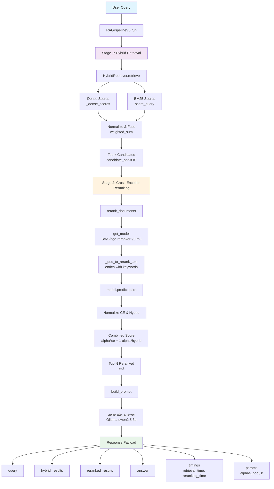

# RAG V3 (Hybrid Retrieval + Cross-Encoder Reranking) — Technical Specification

> Implementation-aware documentation for `ragV3` pipeline, including source file and function mapping for each processing stage.

---

## 1. Scope and Architecture

RAG V3 reuses V1 retrieval (dense + BM25 hybrid) as first-stage recall, then applies a cross-encoder reranking stage before prompt construction and LLM answer generation.

High-level flow:

```text
User Query
  -> HybridRetriever.retrieve(..., method_order=["hybrid"], k=candidate_pool)
  -> rerank_documents(query, retrieved_docs, top_n=k)
  -> build_prompt(query, reranked_docs)
  -> generate_answer(prompt)
  -> structured response (results + timings + params)
```

---

## 2. Source Files and Roles

| File | Role |
|------|------|
| `ragV3\pipeline\rag_pipeline_v3.py` | Main orchestration class (`RAGPipelineV3`) |
| `ragV3\reranking\cross_encoder_reranker.py` | Cross-encoder loading, pair scoring, normalization, combined rerank score |
| `ragV1\hybrid\hybrid_retriever.py` | Stage-1 hybrid retrieval (dense + sparse weighted sum) |
| `ragV1\llm\llm_wrapper.py` | LLM call (`generate_answer`) and JSON extraction |
| `ragV1\prompts\prompt_template.txt` | Prompt base template used by V3 |
| `ragV1\data\iso_controls_enriched.json` | Control corpus (title/objective/description + enrichment fields) |
| `ragV1\app\app.py` | API integration (`POST /v3`, history persistence and reporting) |

---

## 3. Runtime Defaults and Core Constants

### 3.1 Pipeline defaults (`ragV3\pipeline\rag_pipeline_v3.py`)

| Constant | Value | Meaning |
|----------|-------|---------|
| `CANDIDATE_POOL_SIZE` | `10` | Number of hybrid candidates retrieved before reranking |
| `DEFAULT_TOP_K` | `3` | Final number of reranked controls returned |

### 3.2 Reranker defaults (`ragV3\reranking\cross_encoder_reranker.py`)

| Constant | Value | Meaning |
|----------|-------|---------|
| `MODEL_NAME` | `BAAI/bge-reranker-v2-m3` | Default multilingual cross-encoder |
| `MODEL_NAME_MINILM` | `cross-encoder/ms-marco-MiniLM-L-6-v2` | Alternate model path |
| `ALPHA` | `0.8` | Combined score weight for normalized CE score |

Combined score used for sorting:

```text
combined_score = alpha * ce_norm + (1 - alpha) * hybrid_norm
```

---

## 4. End-to-End Processing Steps (Function-by-Function)

## Step 0 — Pipeline initialization

**File:** `ragV3\pipeline\rag_pipeline_v3.py`  
**Function:** `RAGPipelineV3.__init__(project_root: Path | None = None)`

Actions:
1. Resolves V3 root and V1 root path.
2. Sets corpus path to `ragV1\data\iso_controls_enriched.json`.
3. Sets prompt template path to `ragV1\prompts\prompt_template.txt`.
4. Instantiates `HybridRetriever(controls_path=...)`.

---

## Step 1 — Stage-1 candidate retrieval (Hybrid from V1)

**File:** `ragV3\pipeline\rag_pipeline_v3.py`  
**Function:** `RAGPipelineV3.run(...)`

Call:

```python
retrieval = self.retriever.retrieve(
    query=query,
    k=_pool,
    method_order=["hybrid"],
    dense_weight=alpha_dense,
    sparse_weight=alpha_sparse,
)
retrieved_docs = retrieval.get("hybrid_results", [])
```

### Internal retrieval implementation path (reused V1)

**File:** `ragV1\hybrid\hybrid_retriever.py`  
**Functions involved:** `retrieve`, `_dense_scores`, `BM25Retriever.score_query`, `_minmax`, `_build_result`

Stage-1 scoring behavior:
1. Dense score for all docs via `_dense_scores(query)` (dot product on normalized embeddings).
2. Sparse score for all docs via `BM25Retriever.score_query(query)`.
3. Min-max normalize dense and sparse scores.
4. Fuse with weighted sum (`dense_weight`, `sparse_weight`).
5. Sort descending and return top-`k` as `hybrid_results`.

---

## Step 2 — Stage-2 cross-encoder reranking

**File:** `ragV3\pipeline\rag_pipeline_v3.py`  
**Function call:** `rerank_documents(query, retrieved_docs, top_n=k, alpha=alpha_ce)`

### Reranker implementation

**File:** `ragV3\reranking\cross_encoder_reranker.py`  
**Functions involved:** `rerank_documents`, `rerank_with_model`, `get_model`, `_doc_to_rerank_text`, `_normalize`

Detailed reranking flow:
1. `get_model()` lazy-loads `CrossEncoder(MODEL_NAME)` once (singleton cache).
2. `_doc_to_rerank_text(doc)` builds pair text from:
   - `title`, `objective`, `description`
   - `keywords_en`, `keywords_id`
   - `audit_indicators_en` or fallback `audit_indicators_id`
3. Build pair list: `[(query, doc_text), ...]`.
4. Score pairs with `model.predict(...)` -> raw `ce_scores`.
5. Extract original `hybrid_score` from each retrieved doc.
6. Normalize CE and hybrid scores independently via `_normalize(...)`.
7. Compute `combined_score` using alpha-weighted formula.
8. Attach scoring fields per document:
   - `rerank_score` (raw CE)
   - `rerank_score_norm`
   - `hybrid_score_norm`
   - `combined_score`
9. Sort by `combined_score` descending and truncate to `top_n`.

---

## Step 3 — Prompt construction from reranked context

**File:** `ragV3\pipeline\rag_pipeline_v3.py`  
**Functions:** `_load_prompt_template`, `_format_context`, `build_prompt`

Process:
1. `_load_prompt_template()` reads `ragV1\prompts\prompt_template.txt`.
2. `_format_context(reranked_results)` emits one formatted block per control containing:
   - `control_id`, `title`
   - `combined_score`, `ce`, `hybrid`
   - `objective`
   - first ~220 chars of `description`
3. `build_prompt(query, reranked_results)` appends:
   - retrieval+reranking context block
   - user audit question
   - instruction to return exactly one JSON object.

---

## Step 4 — LLM generation and parsing

**File:** `ragV3\pipeline\rag_pipeline_v3.py`  
**Function call:** `generate_answer(prompt)`

**File:** `ragV1\llm\llm_wrapper.py`  
**Functions involved:** `generate_answer`, `call_ollama`, `extract_json`

Behavior:
1. Send prompt to Ollama (`qwen2.5:3b` in current wrapper).
2. Try strict JSON parse first, then regex-based JSON block extraction fallback.
3. Return:
   - parsed JSON if available, else raw text.
4. V3 catches `requests.RequestException` and returns an error object in `answer`.

---

## Step 5 — Final response payload from `RAGPipelineV3.run`

Returned keys:

| Key | Description |
|-----|-------------|
| `query` | Original user query |
| `hybrid_results` | Top candidates from stage-1 hybrid retrieval |
| `reranked_results` | Final ranked candidates after CE reranking |
| `answer` | Parsed LLM JSON or raw/error object |
| `llm_model`, `llm_error` | Model name and network/error status |
| `fusion` | Retrieval fusion metadata from V1 retriever |
| `timings` | `retrieval_time`, `reranking_time`, `total_time` |
| `params` | Effective runtime params (`alpha_dense`, `alpha_sparse`, `alpha_ce`, `candidate_pool`, `k`) |

---

## 5. API Integration Surface (V3)

V3 pipeline is wired from `ragV1\app\app.py`:

| Endpoint | Function |
|----------|----------|
| `POST /v3` | Calls `pipeline_v3.run(...)`, computes metrics, stores into `history_v3` |
| `POST /bulk-v3` | Batch execution using same V3 pipeline |
| `GET /history/v3` | V3 history/session index |
| `GET /history/v3/<slug>` | V3 session detail page |
| `DELETE /history/v3` | Clear V3 history |

---

## 6. Key Difference vs V1

V1 stops at hybrid ranking.  
V3 adds cross-encoder pairwise reranking over hybrid candidate pool, producing `combined_score`-sorted final docs and separated timing instrumentation (`retrieval_time` vs `reranking_time`).

---

## 7. End-to-End Pipeline Flow (Mermaid)


